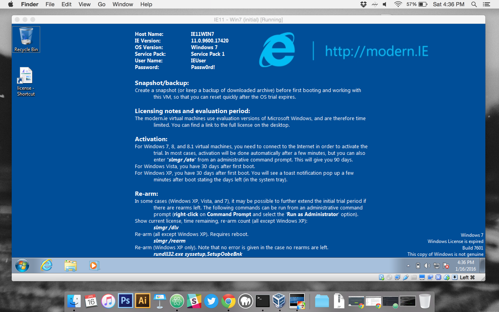


name: inverse
layout: true
class: center, middle, inverse

---

# The Command Line and Your Development Environment

.title-logo[]

---
layout: false

# Agenda

1. Using the command line interface (CLI)
2. Setting up a development environment with Vagrant

---
template: inverse

# What is the Command Line Interface (CLI)?

---
class: center, middle

> "The command line is the ultimate seat of power on your computer...Unfortunately, the price of this power is complexity: nobody ever said that ruling your computer would be easy."

&mdash;David Baumgold

---
class: center, middle

.large[
   With great power also comes great responsibility...
]

---
class: center, middle

.large[
   But where do I find the command line?
]

---

# Command Line Apps

- On a Mac you can use the built-in Terminal app (or iTerm2)
- On Windows, you can use the built-in Cmd.exe, or install PowerShell or Cygwin (we're going to use Cygwin)

---
template: inverse

# Let's Try Out Some Basic Commands

---
# Navigate the File System

`pwd` to figure out where you are:

---

# Navigate the File System

`ls` to the list files in the current directory:

---

# Change Directories

`cd <path>` to get to a sub-folder, and `cd ..` back:

You can also `cd ../..` to go up two levels (and so on).

---

# Change Directories

Pro tip! You can `cd <drag/drop>` to populate the a path and `cd ~` to get all the way back to your home directory:

---

# Work with Files

`touch <file>` to add a file and `rm <file>` to remove it:

---

# Work with Files

You can also copy and move files within the file system:

- `cp <file> <location>` to copy a file
- `mv <file> <location>` to move a file

You can also rename a file using the `mv` command:

- `mv <old-file-name> <new-file-name>`

---

# Work with Folders

`mkdir <folder>` to create a new directory:

Then `rm -r <folder>` to delete it and all of its files.

---

# Work with Folders

Note the structure of the command we use to delete a folder and all of its files: `rm -r <folder>`

The `-r` is known as a **flag** or **option** for the command.

In this case, the `-r` roughly translates to "recursively delete all of the folder's files too."

**This does NOT send the folder/files to the Trash or Recycle Bin. They will be gone forever!**

---

# Work with Folders

If a directory is empty, you can also use `rmdir <folder>` to remove it.

This will only work if the directory does not contain any files (including hidden files).

---
class: center, middle

### Danger Will Robinson!

Never run `rm -rf /` or `rm -rf *` unless you want to delete everything on your computer!

---

# Exercise 1

Let's take the command line for a spin.

[See the lesson page](/lesson/the-command-line-interface-and-version-control/) for further instructions.

---

# Exercise 2

Now let's visualize what we just did on the CLI using humans and Fatboys...

---
template: inverse

# Setting Up Your Dev Environment with Vagrant

---
class: center, middle

.large[
   Vagrant vs. MAMP/XAMPP?
]

---

# What is Vagrant?

- Software to set-up sandboxed dev environments
- Allows you to install a lot of dev-related software **without interfering with your native OS**
- Can help you better match your dev environment to your production environment
- Bonus! Learning Vagrant will give you more confidence navigation around real servers

---
class: center, middle

.large[
   It's like running a computer inside of your computer.
]

---
class: center, middle

.large[
   
]

---
class: center, middle

.large[
   Vagrant is a little different because it has no GUI...
]

---

# Vagrant Commands

Start or resume your server: `vagrant up`

Pause without shutting down your server: `vagrant suspend`

Shutdown your server: `vagrant halt`

Delete your server and everything on it: `vagrant destroy`

SSH into your server: `vagrant ssh`

*More commands can be found [here](https://docs.vagrantup.com/v2/cli/index.html).*

---
class: center, middle

### WTF SSH?

It's a network protocol that allows you to securely send data from one computer to another.

Vagrant allows us to SSH into the server in our virtual machine and run commands on it from our host computer.

---

# Pieces of the Puzzle

**VirtualBox**

A virtual machine *provider* (i.e. allows you to create VMs).

**Vagrant**

A program that allows you to combine the power of a *provisioner* with VirtualBox to create your desired dev environment inside of a VM.

**A Vagrant Box**

A template for creating a development environment with a pre-defined array of base software.

---

# Exercise 3

Let's get ready to install our first Vagrant box:

- Install [VirtualBox](https://www.virtualbox.org/wiki/Downloads)
- Install [Vagrant](https://www.vagrantup.com/downloads.html)

Once Vagrant is installed, run `vagrant -v` to make sure it was installed correctly. (If it was, you'll see the Vagrant version number you're running.)

---
class: center, middle

.large[
   Then what?
]

---

# First Vagrant Box

We'll need to actually set up a Vagrant box to do anything interesting with it.

**[Scotch Box](https://box.scotch.io/)** is a Vagrant LAMP stack that contains all the features we'll need for the next few weeks, such as Node, npm, git, and PHP.

---

# Homework

We've already completed Steps 1-2 in the **Getting Started** section of the **[Scotch Box website](https://box.scotch.io/)**.

Your assignment this weekend is to complete **Steps 3-5** to get your first Vagrant Box up and running.

---

# What We've Learned

- What the command line is
- How to navigate the file system from the CLI
- Why developer benefit from setting up pro dev environments
- How to install VirtualBox and Vagrant

---
template: inverse

# Questions?


