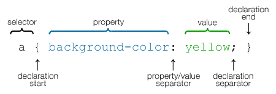


name: inverse
layout: true
class: center, middle, inverse

---

# Intro to CSS

.title-logo[]

---
layout: false

# Agenda
1. What is CSS?
2. Writing CSS Statements
3. What is Cascading Order/Specificity Mean?
4. CSS Selectors
5. CSS Classes and IDs
6. Browser Development Tools
7. What is the CSS box model 

---
template: inverse

# What is CSS?
##Cascading Style Sheets
---
class: center, middle

## Definition
**CSS** is the code that styles HTML elements in webpages, specifying their visual appearance and positioning. The stylesheet, which it’s often referred to, is typically an external file that is linked to one or as many HTML pages as required, thus applying the CSS styles instantly to an entire site at once. 
---
template: inverse

# Writing CSS Statements
---
class: center, middle

## CSS Statement Example

```css

p {
font-family: Helvetica, Arial, sans-serif;
color: blue;
}

```
.inline-images[]

---
## CSS Statement Diagram

.inline-images[]
---
template: inverse

# Cascading Order

---

## Cascading Order

###1. Inline Style (highest priority)
###2. Embedded Style in Head
###3. Imported Style
###4. Linked Style (lowest priority)

---
## Where Styles Are Placed

A statement can be set up in 3 different areas in an HTML webpage.
1.	**INLINE:** it can be defined within an HTML tag in the body of the document.
2.	**EMBEDDED:** it can be defined within the head of a document. 
3.	**IMPORTED:** it can be referenced from within the head tag and the stylesheet is imported from a local server or external website.
4.	**EXTERNAL:** the stylesheet is linked to the HTML page from within the head tag 


---
## Examples of Inline Styles

####Inline CSS Style Applied Directly into an HTML file####

```HTML
<p style=”font-size:14pt; font-style:italic;”> The quick brown fox jumped over the lazy dog. </p>
```

---
## Examples of Imported Styles

####Imported Stylesheet Applied Directly to an HTML file####

```HTML
<head>
<style type=”text/css”>
@import url (http://www.website.com/stylesheetfile.css);
</style>
</head> 
```

---
template: inverse

# Internal vs External CSS

---
## Internal CSS (Embedded Style)
- This type of style is applied to just single pages
- The style is placed within the head section of the html page

## External CSS (Linked Style)
- This type of stylesheet is linked to multiple pages in the same site
- Allows for easy updating site wide
- Content is clearly separated from style
---


## How A Stylesheet Is Linked
***A CSS file*** is basically an external text file with a .css extension. It is saved in the same location as the rest of your HTML files.  Common ways to name your stylesheet:  **style.css** or **stylesheet.css**
The CSS is linked from the HTML document with this code:
<link rel="stylesheet" type="text/css" href="style.css">
It is only necessary to change **“style.css”** to the name of your stylesheet, otherwise, the rest of the <link> tag remains the same as shown. 

---
## Specificity

The more specific rules will take priority over the more general css rules. 
- !Important overrides previous same style
- Inline styles
- Selector Specificity
- Last Rule

---

## Inheritance

Inheritance is when styles get **inherited** by child elements from the parent element. This saves a lot of time rather than specifying the same styles for every element used. 

---
class: center, middle
# CSS Selectors


---
class: center, middle
# CSS Custom Classes 
---
## What are CSS Custom Classes?

A *custom class selector* is defined by a **dot** before the class name. You can provide whatever class name you like, providing you don’t have any spaces or special characters inside the name. You can use numbers/letters in the name, as long as the name is detailed and relevant. The class selector *can* be applied around any word/phrase inline using the <span> tags or to a paragraph-like text block using the <div> tags.

---
class: center, middle
# CSS IDs

---

## What are CSS ID Selectors?

An *ID selector* is similar to a class selector in the way that it can be used to create a unique style that does not have to be applied to any specific HTML selector. ID selectors are defined with a # before the name of the selector. The name can contain numbers and letters in lower or uppercase. Make sure there are no spaces or special characters in the name.

---

template: inverse

# Fin!


