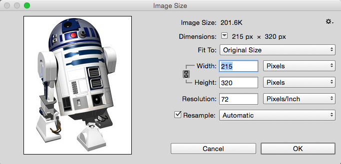
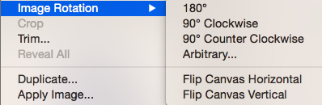
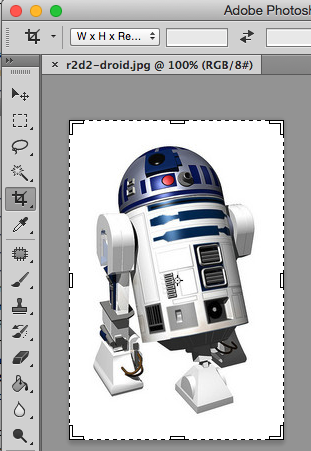
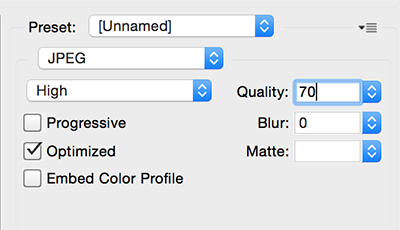


name: inverse
layout: true
class: center, middle, inverse

---

# Using Media on the Web

.title-logo[]

---
layout: false

# Agenda

1. Image editing basics
2. Web-friendly image formats
3. Colour on the web
4. Using the `img` element and its attributes
5. HTML5 `audio` and `video` elements
6. Copyright, the public domain, and Creative Commons

---
template: inverse

# Image Editing Basics

---
class: center, middle

### Image Editing 101

We'll be just covering the basics of image editing to give you the necessary tools to **scale**, **rotate**, or **crop** an image, or save it in a way that's **optimized for the web**.

---

# Scaling an Image Down

**Scaling**: Image &rarr; Image Size &rarr; input new **Width** or **Height**

.inline-images[
   
]

---

# Don't Scale Up Images

Photoshop manipulates **raster** or **bitmap** images that are made of **pixels**, so if you try to scale these images or graphics up they will become pixelated and blurry.

.inline-images[
   
]

---

# Rotating Images

**Rotating**: Image &rarr; Image Rotation &rarr; Select rotate option...

.inline-images[
   

   
]

---

# Cropping Images

**Cropping**: Select Crop Tool &rarr; Drag Crop Box &rarr; Press **Enter** or double-click to apply crop

.inline-images[
   
]

---
# Optimizing Images

**Saving for Web**: File &rarr; Save for Web... &rarr; Apply your settings

For photos, make sure you choose the **JPEG** option, find a happy medium between retaining as much quality as possible while making the image as small as possible.

.inline-images[
   
]

---

# Image Editing Software

- [Adobe Photoshop](http://www.adobe.com/ca/products/photoshop.html) (Mac or PC)
- [Adobe Illustrator](http://www.adobe.com/ca/products/illustrator.html) (Mac or PC)
- [GIMP](http://www.gimp.org/) (Mac or PC)
- [Pixelmator](http://www.pixelmator.com/) (Mac)
- [ImageOptim](https://imageoptim.com/) (Mac)

---
template: inverse

# Web-friendly Image Formats

---

# Common Formats

Today, images for the web are saved in the following formats:

- **JPG/JPEG** (Joint Photographers Group)
- **GIF** (Graphics Interchange Format)
- **PNG** (Portable Network Graphics)
- **SVG** (Scalable Vector Graphics)

---

# JPG/JPEG

This image format is best for **photos**, gradients, and graphics with tonal variations.

It's a **lossy** image format, so this means some of the original image data is lost when saved in this format.

---

# GIF

The GIF format offered a way to save images with one level of transparency in a **lossless** format in the early days of the web, and it's still in use today.

GIFs have a limited colour palette of only **256 colours**, so they work best for simple graphics.

And of course, GIFs are frequently used today for saving **animated graphics**.

---

# PNG

This image format is best images and graphics that need to support **multiple levels of transparency** and a large number of colours.

It's also a **lossless** image format, which means that it preserves all of the file's original data.

---

# PNG-8 vs. PNG-24

*But not all PNGs are created equal!*

**PNG-8** is limited to 256 colours and no transparency, and it's preferable to GIFs for simple images (like icons and logos) with minimal colours.

**PNG-24** is best for photos or graphics that need to support a broader array of colours or multiple levels of transparency.

---
class: center, middle

### A Word of Caution!

PNG-24 may support greater transparency, fading, and gradients when saving photos, but these files will be much larger than JPG which means they will take more bandwidth to download and longer to render.

---

# SVG

The SVG format is newer on the scene, but offer a lot of flexibility.

The image data is rendered as XML and can **scale down or up** without any loss of quality, just like a vector-based image in Illustrator.

SVGs work best for graphics such as **logos and icons**.

When using SVGs, it important to **provide a fallback** image format if you need to support older browsers.

---

# Format Cheatsheet

- Use **PNG-8** over **GIF** for graphics with simple colors
- Use **PNG-24** over **JPEG** when using alpha transparency
- Use **JPEG** over **PNG** for photographic images
- Use **GIF** for animated graphics
- Use **SVG** for icons and logos that need to scale

---

# Formatting Pro Tips

- **Scale down images** to the appropriate size for your webpage
- **Choose the correct** image format
- **Optimize images** to be the best possible quality at the smallest possible size
- **Save** image names with relevant names (that will help with SEO later)
- **Keep a copy** of the original image before optimizing it

---

# Exercise 1

If you haven't done so already, download and install an image editing application such as Adobe Photoshop or Gimp.

Next, download **[this image](https://www.flickr.com/photos/jdhancock/12708712045/)**, open it in the image editor, and try:

- Resizing the image to be a maximum of 800px wide
- Cropping the image to have a 4:3 aspect ratio
- Saving the image to be optimized for web (can you make it less than 70KB without sacrificing too much quality?)

If you have additional time, explore other tools inside the image editor, like the rotate tool or text tool.

---
template: inverse

# Colour on the Web

---

# Using Color

On the web, we have four options for specifying the colours of our HTML elements:

- Colour names
- HEX codes
- RGB/RGBa values
- HSL/HSLa values

---

# Colour Names

There are 147 predefined colour names supported by browsers, which we can use like this:

```css
p {
   color: maroon;
}

a {
   color: MediumSlateBlue;
}
```

Check out [this list](http://en.wikipedia.org/wiki/Web_colors) for all of the names of the predefined colours.

---

# HEX Codes

Alternatively, we can specify a HEX code that corresponds to a specific colour.

For example, the HEX code for white is `#FFFFFF` (or `#FFF` in shorthand).

In your CSS, a HEX code would be used like this:

```css
p {
   color: #111111; /* very dark grey */
}
```

---

# HEX Codes

To get a HEX code, you can use an [online colour picker tool](http://www.colorpicker.com/), or use the colour palette in an image editing program.

.inline-images[
   
]

---

# RGB/RGBa Colours

We can also use RGB (red, green, blue) values to specify colours in our CSS:

```css
a {
   color: rgb(237,67,67);
}
```

The equivalent of this RGB colour in HEX would be `#ed4343`.

---

# RGB/RGBa Colours

Or RGBa values to also specify the opacity of the colour:

```css
header {
   background-color: rgba(237,67,67,0.5);
}
```

The `a` that represents opacity is written as a decimal, with a range of `0` (fully transparent) to `1` (solid).

*Note that RGBa isn't supported by older browsers like IE8.*

---

# HSL/HSLa Colours

Specifying colour using HSLa is similar to using RGBa.

However, instead of giving coordinates for the amount of red, blue, or green to mix in the colour, we specify **hue**, **saturation**, and **lightness**.

```css
header {
   background-color: hsla(360, 83%, 60%, 0.5);
}
```

The relationship between hue, saturation, and lightness will become a bit clearer after the colour theory lesson.

---

# Exercise 2

Try out some of the different web colour modes below:

<iframe height='268' scrolling='no' src='//codepen.io/redacademy/embed/WvOmvY/?height=268&theme-id=0&default-tab=result' frameborder='no' allowtransparency='true' allowfullscreen='true' style='width: 100%;'>See the Pen <a href='http://codepen.io/redacademy/pen/WvOmvY/'>WvOmvY</a> by RED Academy (<a href='http://codepen.io/redacademy'>@redacademy</a>) on <a href='http://codepen.io'>CodePen</a>.
</iframe>

---

template: inverse

# More on the Image Tag

---
class: center, middle

### A Little Bit of History

Images haven't always been a part of the web, but they did arrive early on the scene in 1993. Up until now, the `` tag has only evolved slightly.

---

# The Image Tag

Let's review and dive a little deeper into the `` tag:

```html

```

- `src` tells the browser where to find the image
- `alt` provides a description of the image so the content can be understood by screenreader software and search engines

---

# The Image Tag

The `src` doesn't need to be relative either...we can embed images that are hosted elsewhere on the web:

```html

```

But be a good citizen of the web! Try not to rely on other people's bandwidth serve images to your website.

---

# The Image Tag

We can also specify a few more attributes:

```html

```

- `title` provides further info about the image and is displayed in a tool tip
- `width` sets the the width of the image
- `height` sets the height of the image
- `class` or `id` targets special styles in your CSS

---

# Images and CSS

We can use CSS to manipulate our image elements as well:

```html

```

```css
.align-center {
   display: block;
   margin: 0 auto; /* This centers the element */
   width: 480px;
   height: 320px;
   border: 1px solid #FF3300;
}
```

---

# Exercise 3

Now try using CSS to style these images:

<iframe height='268' scrolling='no' src='//codepen.io/redacademy/embed/mJqwVE/?height=268&theme-id=0&default-tab=css' frameborder='no' allowtransparency='true' allowfullscreen='true' style='width: 100%;'>See the Pen <a href='http://codepen.io/redacademy/pen/mJqwVE/'>mJqwVE</a> by RED Academy (<a href='http://codepen.io/redacademy'>@redacademy</a>) on <a href='http://codepen.io'>CodePen</a>.
</iframe>

---
template: inverse

# Audio & Video

---
class: center, middle

### More from HTML5...

The HTML5 specification gives us two new elements to add media to our websites: `audio` and `video`

---

# Adding Audio

The audio tag should look familiar. It has a `src` attribute just like an `img` tag:

```html
<audio src="macerena.ogg"></audio>
```

If we wanted to set the audio file to autoplay and give the user controls to manage playback, we can add these attributes:

```html
<audio src="macarena.ogg" autoplay="autoplay" controls="controls"></audio>

<!-- This syntax is also valid: -->
<audio src="macarena.ogg" autoplay controls></audio>
```

---
class: center, middle

.large[
   But there's a catch!
]

---

# Fallback Formats

The `audio` tag isn't a self-closing tag for reason...not all browsers support the same audio file formats, so we have to provide fallback formats.

To do this, we take the `src` attribute out of the audio element tag, and nest all of our file formats inside some child `source` tags like this:

```html
<audio autoplay loop controls>
   <source src="macarena.ogg" type="audio/ogg">
   <source src="macarena.mp3" type="audio/mpeg">
   <source src="macarena.wav" type="audio/wav">
</audio>
```

---

# Adding Video

Similar to the audio element, we can add video like this:

```html
<video src="my-video.mp4" controls poster="video-thumb.jpg"></video>
```

The video element gives us `poster` attribute to specify a custom image that should be shown before the video plays.

---

# Fallback Formats

But of course, not all browsers support the same video formats.

We need to provide fallback formats, just like with `audio`:

```html
<video controls poster="video-thumb.jpg">
   <source src="my-video.ogv" type="video/ogg">
   <source src="my-video.mp4" type="video/mp4">
</video>
```

Note that the `.mp4` format with (H.264 encoding) is almost ubiquitously supported now, but you'll likely want to provide at least one fallback in `.ogv`/`.ogg` or `.webm` formats.

---

# Encoding Media

Wondering how you create all of these different versions of your video files?

You'll need an app for that:

- [Miro Video Converter](http://www.mirovideoconverter.com/)
- [EasyHTML5Video](http://easyhtml5video.com/)

And if you need to convert audio files check out [media.io](http://media.io/).

---

# Other Concerns

Always consider if hosting your own audio and video files is the right choice for a given website:

- Do (or your client) you have the **administrative capacity** to juggle all those formats?
- Does your web host provide the necessary **bandwidth** to deliver those files to users?
- Would a **third-party** service like Soundcloud, YouTube, or Vimeo be a better choice?

---

# Exercise 4

Try out the `audio` and `video` elements for yourself:

<iframe height='268' scrolling='no' src='//codepen.io/redacademy/embed/QbBaGE/?height=268&theme-id=0&default-tab=html' frameborder='no' allowtransparency='true' allowfullscreen='true' style='width: 100%;'>See the Pen <a href='http://codepen.io/redacademy/pen/QbBaGE/'>QbBaGE</a> by RED Academy (<a href='http://codepen.io/redacademy'>@redacademy</a>) on <a href='http://codepen.io'>CodePen</a>.
</iframe>

---
template: inverse

# Copyright & Creative Commons

---
class: center, middle

### What media can you use?

When using others' images, audio, and video on your website, it's important to make sure that you're legally allowed to do so.

---

# Copyrighted Material

- Copyright laws are designed to protect a creator's right to be compensated/attributed and to control how their work is used/shared
- All tangible creative works are protected by copyright immediately upon creation
- When in doubt, assume what you want to use is copyrighted material and seek permission to use it or find a suitable royalty-free alternative

---

# Creative Commons

Creative Commons is a non-profit organization devoted to expanding the range of creative works available for others to build upon legally and to share.

Creative Commons licenses allow for free usage of normally copyrighted work and provide the author/creator flexibility in how their work is shared.

.inline-images[
   
]

---
class: center, middle

.inline-images[
   
]

---

# What is CC0?

Let's look at this open type concept [Creative Commons Zero](https://creativecommons.org/about/cc0) where the creator waives all their copyright and related rights by putting them in the **public domain**.

.inline-images[
   
]

---

# CC-Licensed Images

A few good places to find royalty-free, CC-licensed images:

- [Flickr CC search](https://www.flickr.com/search/?license=2%2C3%2C4%2C5%2C6%2C9)
- [The Stocks](http://thestocks.im/)
- [Wikimedia Commons](https://commons.wikimedia.org/wiki/Main_Page)

---

# What We've Learned

- Different image formats that are Web-friendly
- How to crop, scale, rotate, and optimize and image
- How to use different colour formats on the web
- How to work with image elements in CSS
- How to use HTML5 `audio` and `video` elements
- Different types of image licensing

---
template: inverse

# Questions?


