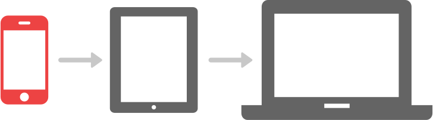


name: inverse
layout: true
class: center, middle, inverse

---

# Intro to Responsive Web Design

---
layout: false

# Agenda

1. What is "Responsive Web Design"?
2. Flexible layouts and grids
3. Flexible images and media
4. Media queries
5. Mobile first

---
template: inverse

# What is "Responsive Web Design"?

---
class: center, middle

.inline-images-border[
   
]

---
class: center, middle

.inline-images-border[
   
]

---
class: center, middle

### A Definition

Responsive web design involves dynamically adjusting a website's layout and content to work on any screen size, resolution, orientation, or device context.

---
class: center, middle

### RWD &ne; Layout

You need to deal with *visual design* and *interaction design* concerns at the same time.

---
class: center, middle

.large[
   Have you ever tried using a multi-level drop-down nav menu that hadn't been optimized for touch screens while on a smartphone?
]

---
class: center, middle

> "Design is not just what it looks like and feels like. Design is how it works."

&mdash;Steve Jobs

---
class: center, middle

.large[
   Jargon alert!
]

---

#Fixed vs. Fluid vs. Adaptive vs. Responsive

**Fixed:** uses set widths and does not scale

**Fluid:** uses percentage-based widths to scale up and down

**Adaptive:** uses media queries to target specific widths, orientations, and devices

**Responsive:** uses fluid grids and media queries, scales up and down accordingly

.footnote[
   *Source: [Team Treehouse](https://teamtreehouse.com/library/build-a-responsive-website/introduction-to-responsive-web-design/fixed-fluid-adaptive-and-responsive-2)*
]

---

# vs. Mobile-Only

- Mobile-only websites are designed specifically to be viewed on mobile devices
- They are not the same the website as the desktop version
- Usually require "browser sniffing" (not foolproof)
- You often find them on "m." sub-domains
- Check out: https://m.facebook.com/
- This is becoming less common today...

---

# What Actually Makes a Design Responsive?

According to Ethan Marcotte...

1. Flexible grids and layouts
2. Flexible images and media
3. Media queries

---

# Flexible Grids & Layouts

Flexible grids (and flexible layouts in general) allow us to build websites that dynamically resize to any width:

.center[
   
]

.footnote[
   *Image Credit: [FROONT Open Design Blog](http://blog.froont.com/9-basic-principles-of-responsive-web-design/)*
]

---

# Flexible Images & Media

Flexible images and media compliment layouts by scaling down or up accordingly as the viewport changes size:

.center[
   
]

.footnote[
   *Image Credit: [FROONT Open Design Blog](http://blog.froont.com/9-basic-principles-of-responsive-web-design/)*
]

---

# Flexible Images & Media

Where appropriated, we can also use vector images (in SVG format) to overcome the limitations of scaling up bitmap-format images:

.center[
   
]

.footnote[
   *Image Credit: [FROONT Open Design Blog](http://blog.froont.com/9-basic-principles-of-responsive-web-design/)*
]

---

# Media Queries

Media queries are CSS rules that allow us to target specific styles for different screen sizes, orientations, and resolutions:

.center[
   
]

.footnote[
   *Image Credit: [FROONT Open Design Blog](http://blog.froont.com/9-basic-principles-of-responsive-web-design/)*
]

---
template: inverse

# Flexible Grids & Layouts

---

# Flex It!

Developing flexible grids and layouts require that we let go of the pixel and embrace "relative" units like `em` and `%`.

We have a formula for determining how to size our elements:

.center.large[
   **target &divide; context = result**
]<br />

Where the **target** is the desired width of the element, **context** is the width of the parent element, and the **result** the relative width of the element.

---

# An Example

Traditionally, you may have had a page layout like this:

```html
<div class="container">
   <article>This is the content...</article>
   <aside>This is the sidebar...</aside>
</div>
```

```css
.container {
   width: 960px;
}

article {
   width: 640px;
   float: left;
}

aside {
   width: 320px;
   float: right;
}
```

---

# An Example

Now, we opt for percentages to make them flexible:

```css
.container {
   width: 100%; /* fill the screen */
}

article {
   width: 66.7%; /* 640px ÷ 960px = 0.667 */
   float: left;
}

aside {
   width: 33.3%; /* 320px ÷ 960px = 0.333 */
   float: right;
}
```

---
template: inverse

# Flexible Images & Media

---

# Wrangling Media

Flexible layouts are great, but images and other media require special attention in RWD.

CSS offers some helpers to assist with this wrangling:

- `max-width`
- `min-width`
- `max-height`
- `min-height`

---

# max-width

Using `max-width` is a handy way scale your media:

```css
img, video {
   max-width: 100%; /* adhere to container width */
   height: auto; /* make sure height scales correctly */
}
```

Setting the `max-width: 100%` property will ensure that the element is never larger than it's container.

---

# min-width

Conversely, `min-width` can ensure that a particular element never shrinks below a certain width:

```css
.logo {
   width: 20%; /* scale the logo */
   min-width: 200px; /* but make sure it's at least 200px */
}
```

---

# Exercise 1

Use percentage widths and min/mix width/height to do something interesting...

---

template: inverse

# Media Queries

---

# More on Media Queries

The idea of targeting media for specific devices has been around for a long time.

Even in pre-CSS3 days, we could target styles for different media types using the `media` attribute in a `link` tag:

```html
/* These styles are targeted for display in the browser screen */
<link rel="stylesheet" href="styles.css" media="screen" />

/* These styles customize the page so it works better for print */
<link rel="stylesheet" href="print.css" media="print" />
```

---

# Old Dog, New Tricks

Today, we can take that a step further and target our stylesheets for more specific circumstances:

```html
<link rel="stylesheet" href="styles.css" media="all and (max-width: 960px)">
```

The CSS in this stylesheet will apply to all types of media, but only if they are 960px wide or less.

Currently available media types include `all`, `screen`, `print`, and `speech`.

---

# Old Dog, New Tricks

With media queries today, we can translate this directly into CSS as well:

```html
<!-- In the <head> tag of an .html file... -->

<link rel="stylesheet" href="styles.css" media="all and (max-width: 960px)">
```

```css
/* In a .css file... */

@media all and (max-width: 960px) {
   /* Targeted CSS goes here... */
}
```

Bonus! Putting multiple media queries in one stylesheet saves additional HTTP requests, which is better for site performance.

---

# Media Query Anatomy

The code you stick inside your media query rules works just like any other CSS:

```css
@media screen and (max-width: 960px) {

   body {
      color: red;
   }

}
```

This rule would change the color of the body text to red if the screen is 960px wide or less.

---

# Media Query Anatomy

Also notice the use of the word `and` in the following code.

This is called a **logical operator** and it allows you to specify multiple conditions that must be met in order for the code to be executed:

```css
@media screen and (max-width: 960px) {

}
```

*We'll revisit logical operators again when we learn JavaScript...*

---

# Media Query Anatomy

We can chain more than two conditions together using `and`:

```css
@media screen and (min-width: 480px) and (max-width: 960px) {

}
```

Or comma separate them:

```css
@media screen and (min-width: 480px) and (max-width: 960px),
(min-width: 1200px) {

}
```

---

# Media Query Anatomy

You can specify the screen orientation:

```css
@media screen and (max-width: 960px) and (orientation: landscape) {

}
```

Or target high-density pixel displays, like the Retina screens on Apple devices:

```css
@media (-webkit-min-device-pixel-ratio: 2),
(min-resolution: 192dpi) {

}
```

---

# Choosing Breakpoints

In the earlier days of RWD, people tended to choose breakpoints based on popular device resolutions.

Then this happened...

---

background-image: url(../../public/img/slide-assets/rwd-device-proliferation.jpg)

.footnote.white[
   Image Credit: [Luke Wroblewski](https://www.flickr.com/photos/lukew/10430507184/)
]

---
class: center, middle

### Reductionist approach to breakpoints:

> "Start with the small screen first, then expand until it looks like shit. TIME FOR A BREAKPOINT!"

&mdash;Stephen Hay

---
template: inverse

# Mobile First

---

# A Mobile First Approach

Mobile-first means exactly that...start by considering the (smallest) mobile context first:

.center[
   
]

.footnote[
   *Image Credit: [FROONT Open Design Blog](http://blog.froont.com/9-basic-principles-of-responsive-web-design/)*
]

---
class: center, middle


---
class: center, middle



---

# A Mobile First Approach

This means more than simply starting with your smallest breakpoint and building your layouts up from there.

You also need to consider:

- Delivery of appropriately optimized images for a particular screen sizes and resolutions
- Minimizing HTTP requests and page weight to improve page load speed
- What people actually need to see and do with your website on mobile devices!

---

# Exercise 2

Use media queries...

---

# Exercise 3

Go through case studies...

---
template: inverse

# Fin!


