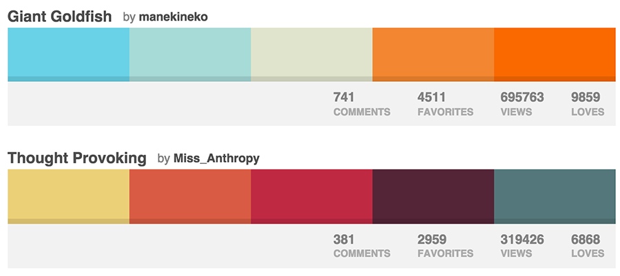


name: inverse
layout: true
class: center, middle, inverse

---
template: inverse
# Design Principals

---
layout: false

# Agenda

1. Learn about design concepts (e.g. Gestalt principles)
2. Build aesthetic colour palettes
3. Prioritizing and organizing content on a page
4. Using Fonts
5. Discover useful design tools
---
template: inverse

# Basic Design Concepts Intro

---
## Essentials of Gestalt Principles

Let's take a closer look at the key principles:

[Gestalt Principles](http://graphicdesign.spokanefalls.edu/tutorials/process/gestaltprinciples/gestaltprinc.htm)

[How to Use Gestalt Principles in Website Design](http://graphicdesignjunction.com/2013/05/how-to-use-the-gestalt-principle-in-your-web-design-projects/)

.inline-images[]

---
template: inverse

# Colour Theory/ Colour Palettes

---
## Foundations of Colour Theory

####Using colour in a harmonious and effective manner is very important in web page design. You want to bring in a right mix of colours to have certain words or sections pop out to attract viewer's attention.
• [Basic Color Theory](http://www.colormatters.com/color-and-design/basic-color-theory)• [Colour Trends & Inspiration](http://www.colourlovers.com)

.inline-images[]
---
template: inverse

# Prioritizing & Organizing Content

---
## Help Users Find What They Are Looking For Part 1
By prioritizing content, key messages can be communicated faster.

###Prioritizing Content
- Make certain areas more *distinct*
- Create a *visual hierarchy* to focus on key messages

---
## Help Users Find What They Are Looking For Part 2
By organizing content, information can be communicated much clearer.

###Organizing Content
- Group together related *chunks of content*
- Present information in *similar visual styles*

---
template: inverse
#Using Fonts

---
## System Fonts vs Web Fonts
###### Later this week, you will learn about web fonts and how to pull them into your website. This method will open up many more font styling options for your sites.  But for now, you will continue to make use of system fonts and incorporate 2-3 alternates before specifying the font family. Remember, there are 5 font families that can be referenced when using system fonts:
- Sans-serif
- Serif
- Monospace
- Script
- Fantasy

---
template: inverse
#Exploring Design Tools

---
## Useful Design Tools
###Colour Palette Generator -[Coolors.co](http://coolors.co/)
###Colour Scheme Designer - [Paletton.com](http://paletton.com/)
###Patterns - [SubtlePatterns.com](http://www.subtlepatterns.com)
 

---
template: inverse

# Fin!


