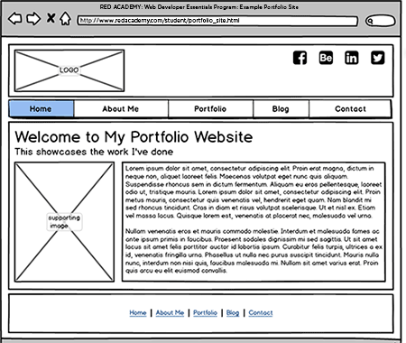


name: inverse
layout: true
class: center, middle, inverse

---

template: inverse
# Intro to Wireframing

---
layout: false

# Agenda

1. What is a Wireframe?
2. Online Tools for Wireframing like Balsamiq
3. Key Elements to include in a wireframe
4. Different Design considerations for Smartphone, Tablets and Desktop
---

template: inverse
# What is a Wireframe?

---
class: center, middle
## What are Wireframes?
A wireframes is a simple representation of a website in simple visual blocks.
class: center, middle

---
class: center, middle

### What to Show
A wireframe shows the layout of the logo, banner, navigation, content, side bars and footer that you may have in a website. 
 
---
class: center, middle

### What Not to Include
A wireframe *shouldn't* include colour scheme, fonts, background styles or any images. It focuses more on visual hierarchy of information and functional requirements such as accessibility are also addressed.
 
---
template: inverse
# How to Wireframe
---
class: center, middle

### Balsamiq.com
We will be using the online web trial version of [Balsamiq](http://www.balsamiq.com) to create each page of a website. From there, you can save out your working Balsamiq .XML file, as well as the PDF or PNG version.

---

template: inverse
# Sketching as an alternative

---

template: inverse

# Fin!


