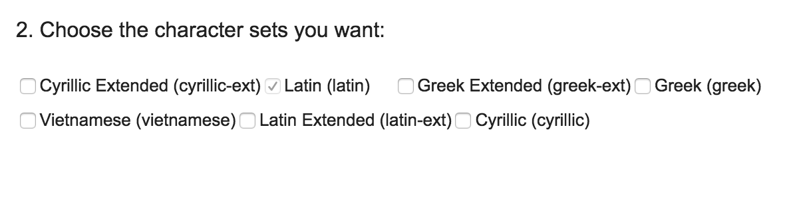
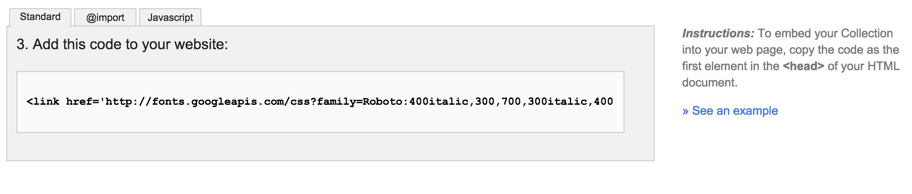
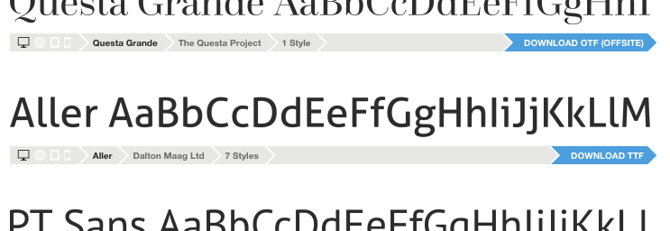
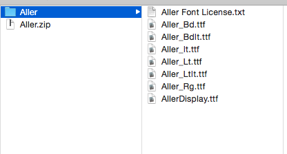


name: inverse
layout: true
class: center, middle, inverse

---

# Using Custom Webfonts

---
layout: false

# Agenda

1. Introduction to Web Fonts
2. Using Google Web Fonts
3. Using @font-face and Font Squirrel

---

template: inverse

# Intro to Web Fonts

---

.left-column[
  ## System Safe Fonts
]

.right-column[
We used to be limited in our font choice:
Remember these? 
  - <span style="font-family: Arial">Arial</span>
  - <span style="font-family: Times">Times New Roman</span>
  - <span style="font-family: Courier">Courier New / Courier</span>
  - <span style="font-family: Comic Sans, Comic Sans MS ">Comic Sans</span>
  ]

---

## Thanks to better web standards we can now use web fonts

---

## Leaving System Safe Fonts as a Thing of the Past

### Web fonts are now a must to ensure consistency across ALL devices mobile)

---

template: inverse

# Google Web Fonts

---

1. Choose your font
2. Choose your weights + character sets
3. Options for using google fonts
4. Declare the font-family in your css

---

## 1. Choose your font.

I like to use [google font pairing](http://femmebot.github.io/google-type/ "google font pairing") as a resource for choosing fonts.

---

## 2. Choose your weights


Like Google Says: only choose what you need, otherwise your page will slow down. 

---

## 2... and character sets.

Google Character Sets



Choose your character sets, (Always defaults to Latin Alphabet for english.)

---

## 3. Options for using google fonts

### HTML , @import and Javascipt



I usually use the `<link>` tag in the header of my site as my option for deployment.

---

## 4. Declare the font-family in CSS

### in your css where you want to use the fonts (remember to set fallback fonts)

```css

h1, h2, h3, h4, h5 ,h6 {
     font-family: ‘Megrim', 'sans-serif';
 }

body {
      font-family: ‘Roboto’, ’sans-serif';
}

```

---
template: inverse

# @font-face and Font Squirrel

---

1. Choose your Font + Download
2. Choose your weights
3. Upload to Web Font Generator
4. Download + Link Stylesheet
5. Declare Font-Family

---

##1. Choose your Font + Download

Font Squirrel has curated lists.




---

##2. Choose your weights




---

##3. Upload to Web Font Generator


---

##4. Download + Link Stylesheet

```html

```

---

##5. Declare Font-Family

---

template: inverse

# Fin!


