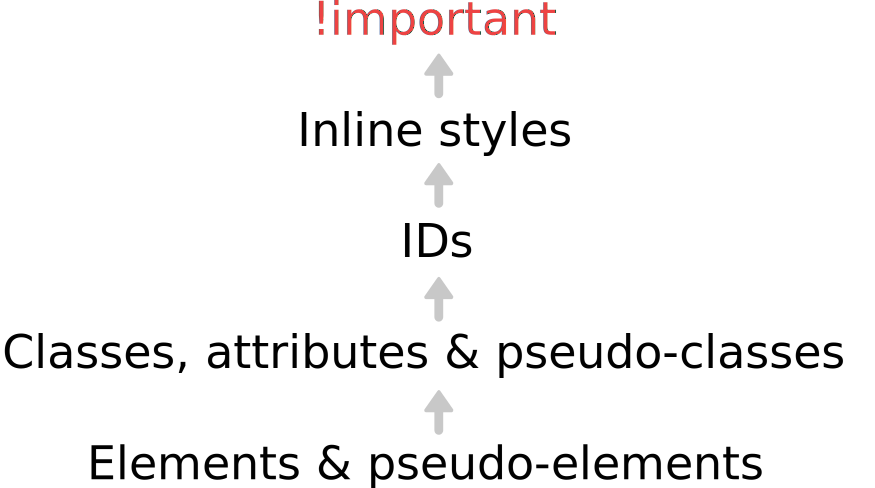


name: inverse
layout: true
class: center, middle, inverse

---

# CSS Best Practices

.title-logo[]

---
layout: false

# Agenda

1. Specificity: taming the specificity beast
2. CSS that's maintainable and scalable
3. OOCSS FTW?
4. BEM
5. 'Semantic' CSS 

---
class: center, middle

# Best practice, or best practice.

---
template: inverse

# Specificity

---
class: center, middle

### What We Mean by "Specificity"

Specificity determines which CSS rules are applied to an element by the browser.

---

class: center, middle

.large[
   What makes a rule more specific?
]

---
class: center, middle



---
class: center, middle

.large[
   So how does it work?
]

---
class: center, middle

.large[
   Keep these 2 things in mind...
]

---

# How Specificity Works

**Where specificity is equal, the rules that comes last applies.**

```html
<header class="masthead">
   <h1>My Awesome Site</h1>
</header>
```

```css
header h1 {
   color: black;
}

header h1 {
   color: red;
}
```

The color of the `h1` text will be red in this case.

---

# How Specificity Works

**Where specificity is not equal, the more specific rule applies.**

```html
<header class="masthead">
   <h1>My Awesome Site</h1>
</header>
```

```css
.masthead h1 {
   color: black;
}

header h1 {
   color: red;
}
```

The color of the `h1` text will be black in this case.

---
class: center, middle

.large[
   Gotcha alert!
]

---

# Specificity Run Amok

It doesn't take much for CSS specificity to spiral out of control:

```html
<nav id="social-nav">
   <ul class="social-links">
      <li><a href="#" class="social">Facebook</a></li>
   </ul>
</nav>
```

```css
nav#social-nav ul.social-links li a.social:hover {
   color: white;
}
```

**Yikes!**

---

# Specificity Run Amok

There's a good chance that CSS would be just as effective written as follows:

```css
.social:hover {
   color: white;
}
```

---

# Taming the Beast

Here are a few strategies to help avoid painting yourself into a corner with CSS specificity:

- Almost never use `!important`
- Don't use IDs as CSS selectors
- Avoid nesting selectors unnecessarily
- Don't over-qualify selectors
- Use classes, and create re-usable classes wherever possible

---

# Exercise 1

Let's experiment with CSS rule specificity:

<iframe height='268' scrolling='no' src='//codepen.io/redacademy/embed/XbpXdG/?height=268&theme-id=0&default-tab=css' frameborder='no' allowtransparency='true' allowfullscreen='true' style='width: 100%;'>See the Pen <a href='http://codepen.io/redacademy/pen/XbpXdG/'>XbpXdG</a> by RED Academy (<a href='http://codepen.io/redacademy'>@redacademy</a>) on <a href='http://codepen.io'>CodePen</a>.
</iframe>

---
template: inverse

# Scalability & Maintainability

---
class: center, middle

### Your CSS Should Scale Easily

We may have good intentions when we start writing our CSS, but as a project grows over time we need to make sure we're writing CSS that's **maintainable** and that **scales**.

---

# CSS Pro Tips

1. Keep your code organized
2. Use semantic selector names
3. Document your code with comments
4. Make it modular

---

# Get Organized

Well-organized code will save you headaches in the long run. Here are some organization tips:

- Order things logically (it matters for specificity, but also for readability)
- Put your properties in some kind of logical order
- Use whitespace, line breaks, and indentation
- Use shorthand wherever possible
- Be consistent!

---

# Keep It Semantic

The class and ID names you choose for your HTML elements should relate to the content itself, and not the styles applied to it. For example, this:

```html
<p class="alert">Error! Please try again.</p>
```

Is much more semantic and future-proof than this:

```html
<p class="red">Error! Please try again.</p>
```

---

# Document It

Adding comments to your code is an effective way to explain what your code does, both to other developers and to your future self. For example, this:

```css
/* Main navigation */
.dropdown-nav { }

/* Footer navigation */
.inline-nav { }
```

Is more helpful than this:

```css
.dropdown-nav { }
.inline-nav { }
```

---

# Modularity

Modular code is reusable code. For example, abstracting re-used styles into a class like this:

```css
.brand-color {
   color: red;
}
```

Is better than this:

```css
article h3 {
   color: red;
}

aside h3 {
   color: red;
}
```
---
template: inverse

# Semantics

---
class: center, middle

### Semantic === **meaningful**.

---

# We've seen this before:

HTML5 is designed to be **semantic**.

```html<section>
        <article>
            <header>
                <h1>Article #1</h1>
            </header>
            <section>
                This is the first article.  This is <mark>highlighted</mark>.
            </section>
        </article>
        <article>
            <header>
                <h1>Article #2</h1>
            </header>
            <section>
                This is the second article.  These articles could be blog posts, etc.  
            </section>
        </article>
    </section>
 ```
 
---
class: center, middle

# Semantic - UI

[Semantic UI Framework (Github Repo)](https://github.com/semantic-org/semantic-ui/)

---
template: inverse

# BEM (Block Element Modifier)

---

# What is BEM?

- Developed by Russian 'Yahoo' (Yandex)
- They call it a 'methodology'
- Started as method for developing maintainable css & is now a standalone platform.

# Why?
1. Fast development and long-lasting results for standard projects
2. A project involves many people
3. Scalable teams
4. Code reuse

---
class: center, middle

While 100% predictable code may never be possible, it's important to understand the trade-offs you make with the conventions you choose. If you follow strict BEM conventions, you will be able to update and add to your CSS in the future with the full confidence that your changes will not have side effects.

---

```css
   /* Block */
   .btn {
     text-decoration: none;
     background-color: white;
     color: #888;
     border-radius: 5px;
     display: inline-block;
     margin: 10px;
     font-size: 18px;
     text-transform: uppercase;
     font-weight: 600;
     padding: 10px 5px;
   }
   
   /* Element */
   .btn__price {
     background-color: white;
     color: #fff;
     padding-right: 12px;
     padding-left: 12px;
     margin-right: -10px; /* realign button text padding */
     font-weight: 600;
     background-color: #333;
     opacity: .4;
     border-radius: 5px 0 0 5px;
   }
   
   /* Element */
   .btn__text {
     padding: 0 10px;
     border-radius: 0 5px 5px 0;
   }
   
   /* Modifier */
   .btn--big {
     font-size: 28px;
     padding: 10px;
     font-weight: 400;
   }
   
   /* Modifier */
   .btn--blue {
     border-color: #0074D9;
     color: white;
     background-color: #0074D9;
   }
   
   /* Modifier */
   .btn--orange {
     border-color: #FF4136;
     color: white;
     background-color: #FF4136;
   }
   
   /* Modifier */
   .btn--green {
     border-color: #3D9970;
     color: white;
     background-color: #3D9970;
   }
```

[BEM Codepen](http://codepen.io/team/css-tricks/pen/226a65c8f7d64615aabd45048d1d3b6d)

---
template: inverse

# OOCSS

---
class: center, middle

### What is OOCSS?

Object oriented CSS (OOCSS) is a methodology of writing reusable CSS that is fast, scalable, and maintainable.

---

# What Makes CSS OOCSS?

Nicole Sullivan came up with the framework for OOCSS.

According to her, there are two basic principles of OOCSS:

1. Separation of **structure** from **skin**
2. Separation of **containers** from **content**

---

# Structure vs. Skin

Separating structure from skin includes abstracting the layout of an element away from the theme of a website. So this:

```css
.widget {
   width: 30%;
   background: yellow;
}
```

Becomes this:

```css
.grid-col-4 {
   width: 30%;
}

.widget {
   background: yellow;
}
```

---

# Container vs. Content

Separating content from the container involves removing the dependency of a parent element nesting children elements. So this:

```css
.sidebar h2 {
   border-bottom: 1px solid #000;
}
```

Becomes this:

```css
.widget-heading {
   border-bottom: 1px solid #000;
}
```

---
class: center, middle

### Word of Caution!

Strictly adhering to OOCSS isn't always practical in reality. Take these as basic guidelines, rather than rules to live by.

---

# Exercise 2

Let's clean up some code with the best practices we just learned:

<iframe height='268' scrolling='no' src='//codepen.io/redacademy/embed/BNpjxY/?height=268&theme-id=0&default-tab=css' frameborder='no' allowtransparency='true' allowfullscreen='true' style='width: 100%;'>See the Pen <a href='http://codepen.io/redacademy/pen/BNpjxY/'>BNpjxY</a> by RED Academy (<a href='http://codepen.io/redacademy'>@redacademy</a>) on <a href='http://codepen.io'>CodePen</a>.
</iframe>

---

# What We've learned

- How to leverage (and tame) specificity in our CSS
- How to write write CSS that's future-friendly and easier to maintainable
- What OOCSS is

---
template: inverse

# Questions?


