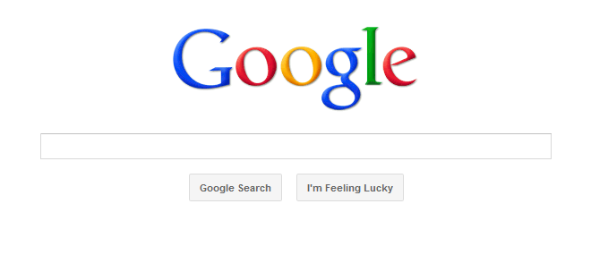


name: inverse
layout: true
class: center, middle, inverse

---

# HTML Forms

.title-logo[]

---
layout: false

# Agenda

1.  Discover why it's important to use forms
2.  Learn about how forms work
3.  Get familiar with various form control elements
4.  How to target form elements with values/IDs

---

template: inverse
#Why Use Forms?

---
## Why We Use Forms

Forms are a way for the users/viewers of your site to provide you with feedback about anything that you’d like to find out from them. Forms provide a uniform way for those users to interact with a website quickly and easily through their web browser, rather than directly through email. 

---
## Everyday Uses for Forms

Forms that you typically see include ones that ask for your mailing information, like an order forms, or ask for your opinions, like surveys. There are many uses for forms especially in online commerce and retail transactions and online banking. 
---
### How Often Do You Google Everyday?

Forms like Google allow us to **GET** information from a database.
.inline-images[]

---
### How Often Do You Buy or Pay for Something Online?
Checkout forms allow you input your information & payment information for a company to process your order. 

.inline-images[]

---
template: inverse
# How Forms Work

---
## How Do Forms Work?

The basic syntax for a form is: 
```HTML
<form action="[URL]">

form data elements and input fields

</form>
```

#####You can only put one form per HTML page, but that form can contain many form elements, as discussed on the next slide.#####

---
## How Do Forms Work?

When the form is submitted, the form data is sent to the URL specified in the ACTION attribute. In a basic email handler example, this URL will refer to a client-side program (user’s email program) that will process the form data. The form itself should contain: 

- At least one submit button `<input type="submit">`
- Some form data elements  `<input>,<textarea>,<select>`
- Additional markup (e.g., identifying data elements through IDs and Values, and presenting instructions as needed. 

---
## Parts of a Form

**FORM** tags tells the browser, where it ends and begins. 

**ACTION** tag tells the browser where to send the information. 

**INPUT TYPE** represents the form objects that will gather information.

**ENCTYPE** represents how the input collected is ‘encrypted’. Usually it has a value of “text/plain” for basic forms, to make sure that the data is kept in its raw form, rather than converted into some encrypted text.

---
## Basic Form Structure

######This basic form consists of a couple text fields, and a text area followed by a Submit button.  An example of this type of form would just ask for the user’s feedback.######

<iframe height='268' scrolling='no' src='//codepen.io/redacademy/embed/xGqjZm/?height=268&theme-id=0&default-tab=result' frameborder='no' allowtransparency='true' allowfullscreen='true' style='width: 100%;'>See the Pen <a href='http://codepen.io/redacademy/pen/xGqjZm/'>xGqjZm</a> by RED Academy (<a href='http://codepen.io/redacademy'>@redacademy</a>) on <a href='http://codepen.io'>CodePen</a>.
</iframe>

---
template: inverse
# Types of Form Controls

---
## Types of Form Controls

###1. Adding Text
###2. Making Choices
###3. Submitting Forms
###4. Uploading Files

---
## Types of Form Elements
### 1. Adding Text
- Text Input (Single Line)
`<input type="text" name="username" size="20" />`

- Text Area (Multi Line)
`<textarea name="comments" cols="20" rows="4"> Your Feedback Please! </textarea>`

- Password Input
`<input type="password" name="password" size="12" maxlength="20" />`

---
## Types of Form Elements
### 2. Making Choices
- Radio Buttons
`<input type="radio" name="sports" value="hockey" />`

- Check Boxes
`<input type="checkbox" name="musicservice" value="spotify" />`

- Drop Down Menus
`<select name="devices">
	<option value="iPad">`

---
## Types of Form Elements
### 3. Submitting Forms
- Submit Buttons
`<input type="submit" name="subscribe" value="Subscribe" />`

- Image Buttons
`<input type="image" src="images/subscribe_btn.jpg" width="200" height="50">`

---
## Types of Form Elements
### 4. Uploading Files
File Upload Button
`<input type="file" name="client-proposal" /><input type="submit" value="Upload" />`

---
## Label Form Controls
Add the label tag to help with accessibility for vision-impaired users. The label tag should be wrapped around both text description and for input type.

`<label>Name:<input type="text" name="fullname" /></label>`

#####*Note* that for radio buttons, the label tag is utilized with a **for** attribute.#####

---

## How to Target Form Elements

When defining a form element such as an text input for a **Name** field for instance, you'll want to also put in a **Value** and **ID** as well, so that these elements can be targeted through CSS as well as Javascript.

`<input type="text" name="firstname" id=”firstname” size=”60” />`

---
template: inverse

# Fin!


