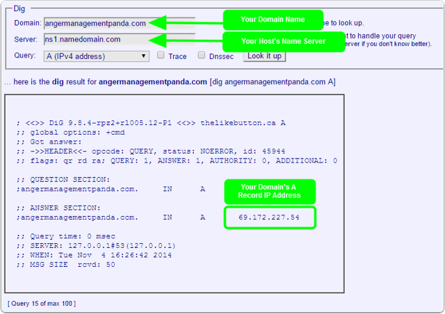
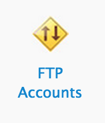
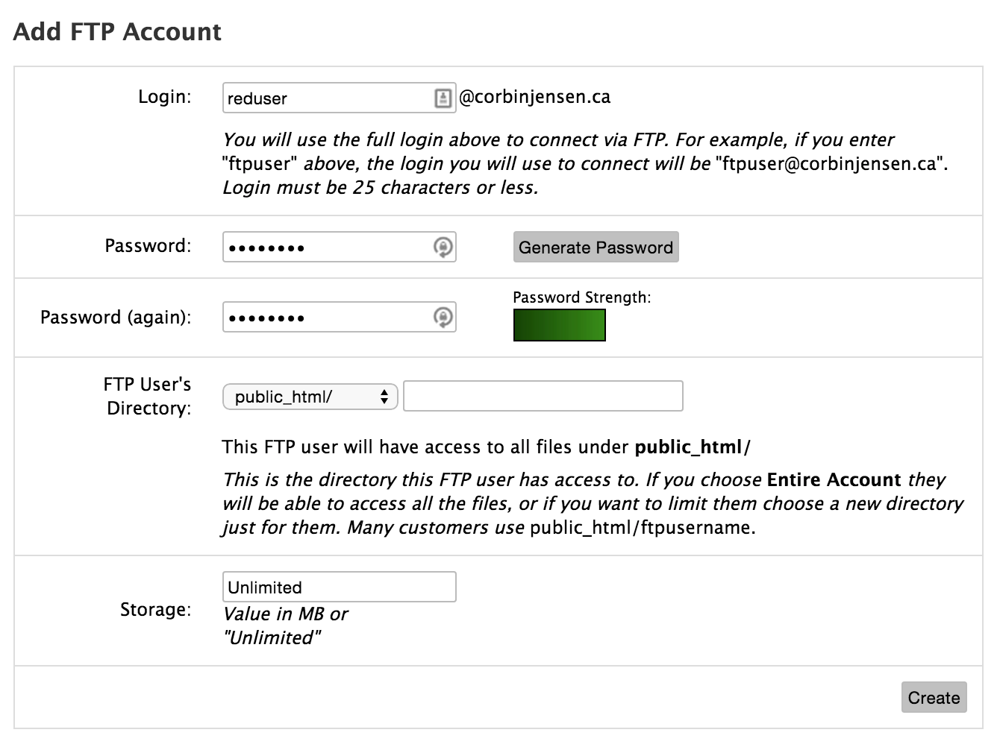
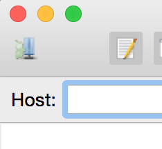
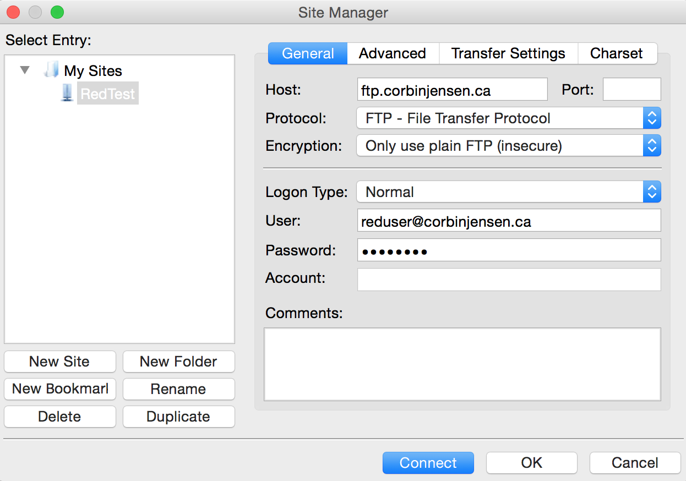
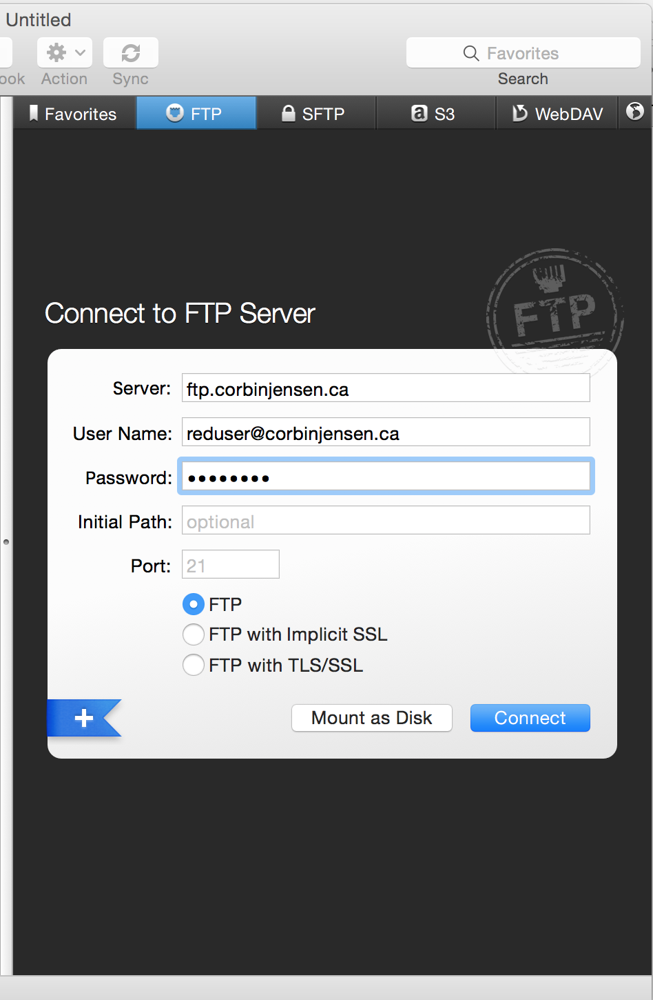
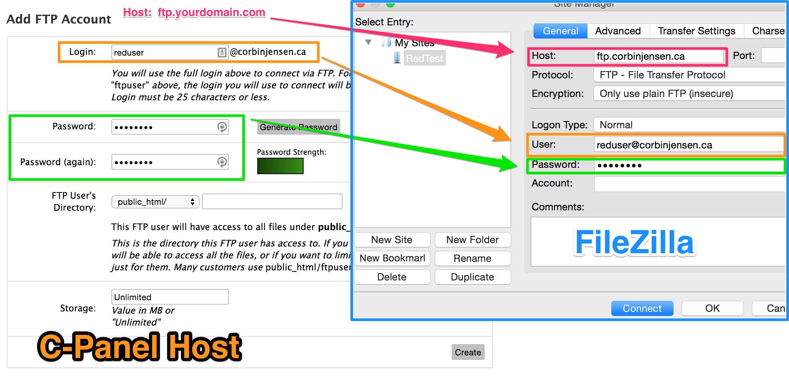
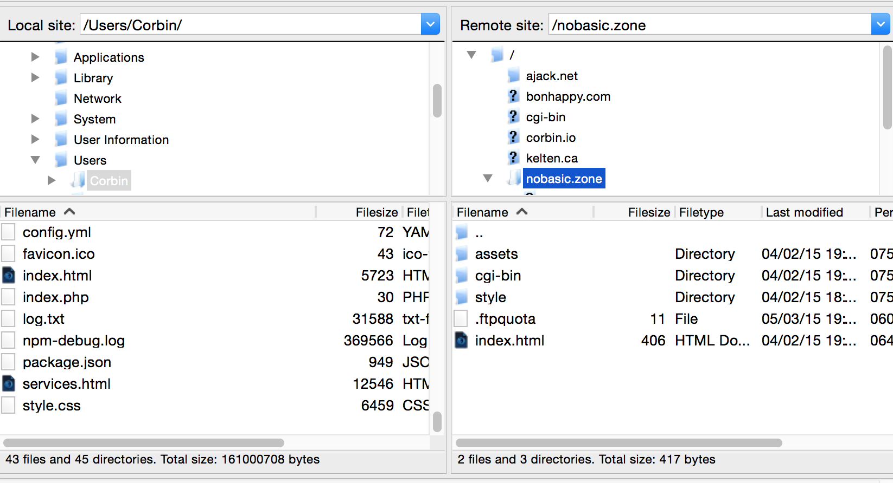
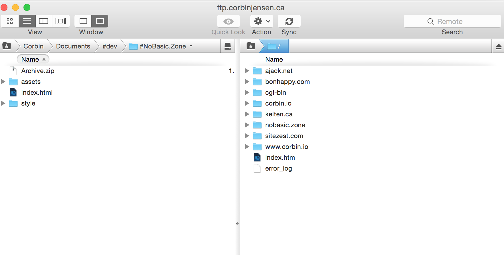


name: inverse
layout: true
class: center, middle, inverse

---

# Web Hosting

---
layout: false

# Agenda

We are going through the process of getting your site online:

1. Domain Name Purchasing
2. Choose and Purchase Web Hosting
3. Domain Name: Set Name Servers 
4. Configure FTP Software
5. FTP Lab - Upload Website

---
template: inverse

# Domain Name Purchasing

---

we recommend hover because of its simple, no spam design and great customer service.

1. Go to www.hover.com
2. Type in your desired domain name
3. Add the domains you want to your cart
4. Register for the service and pay (keep this user and password handy)

---
template: inverse

# Choosing the Right Web Hosting

---

Now that you have a domain now its time to find the right hosting plan for you.

---

There are many good options on the internet:

---

You can find one that matches your vibe and values

Larger host is usually better as they can offer customer service. 
-  Consistent uptime
-  c-panel based
-  24 hour support
-  month to month payment option

 We recommend http://www.bluehost.com/ for your website. 

---
template: inverse

# Set Name Servers

---

Now we need to tell your domain name to point to your new web host. 
First google “Yourwebhost” + Nameservers and get them,

---

For Hover we also need the IP address, we can look it up here: 

---
template: inverse

# Configure FTP Software

---

Login to your web host :

Click on FTP Accounts

---

- Configure your own username and password as pictured, *Make sure that your directory is set to public_html*

---

Now open Filezilla, and click on this icon the top right corner: 

---

Name your new connection, and put in your information and configure it like so. 

---

and on Transmit: 

---

---

---

---

---
template: inverse

# FTP Lab - Upload Website

---


