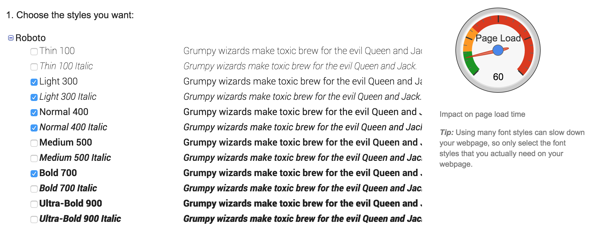


name: inverse
layout: true
class: center, middle, inverse

---

# Using Custom Web Fonts

.title-logo[]

---
layout: false

# Agenda

1. Custom fonts on the web
2. Using `@font-face`
3. Using Google Fonts
4. Web font services
5. Choosing and pairing fonts

---

template: inverse

# Intro to Web Fonts

---
class: center, middle

### A bit of history...

We used to be limited to using **web-safe fonts** on our websites, in other words, fonts that you could be reasonably sure would already be installed on a user's computer system.

---

.left-column[
  ## Web-Safe Fonts
]

.right-column[
As a result, we had very few choices:

  - <span style="font-family: Arial">Arial</span>
  - <span style="font-family: Times">Times New Roman</span>
  - <span style="font-family: Courier">Courier New / Courier</span>
  - <span style="font-family: Comic Sans, Comic Sans MS">Comic Sans</span>
  - <span style="font-family: Verdana">Verdana</span>
]

---
class: center, middle

.large[
   Thanks to CSS3, <br />those days are over!
]

---
template: inverse

# @font-face

---

# Using @font-face

The `@font-face` property in CSS allows us to embed custom fonts directly in our website.

That means we don't have to depend on a user having that font already installed on their computer.

```css
@font-face {
    font-family: 'robotoregular';
    src: url('Roboto-Regular-webfont.eot');
}
```

---

# Using @font-face

Once you've included an `@font-face` declaration at the top of your stylesheet, you can use it throughout your CSS:

```css
body {
   font-family: 'robotoregular', Arial, sans-serif;
}
```

---

# There's a Catch

Unfortunately, different browsers support different font formats, so when we use `@font-face` we need to make sure we include multiple versions of the same font:

- **EOT** - IE only.
- **WOFF** - Compressed, emerging standard.
- **TTF** - Works in most browsers except IE and iPhone.
- **SVG** - iPhone/iPad.

---

# Font Formats

A full example:

```css
@font-face {
    font-family: 'robotoregular';
    src: url('Roboto-webfont.eot');
    src: url('Roboto-webfont.eot?#iefix') format('embedded-opentype'),
         url('Roboto-webfont.woff') format('woff'),
         url('Roboto-webfont.ttf') format('truetype'),
         url('Roboto-webfont.svg#robotoregular') format('svg');
    font-weight: normal;
    font-style: normal;
}
```

Order matters! You'll want to include the `src` files for your fonts in this order: `eot`, `woff`, `ttf/otf`, and then `svg`.

---

# Font Squirrel

The website [Font Squirrel](http://www.fontsquirrel.com/) is a great resource for finding and creating `@font-face` font packages:

.inline-images[
   
]

---
class: center, middle

## Thar be copyright dragons!

Before you embed a font on your website using `@font-face` you need to be sure that its license enables you to do so.

---

# Exercise 1

Go to **[Font Squirrel](http://www.fontsquirrel.com/)** and pick a font that you like that offers an @font-face kit. Download the font package.

Set-up an `index.html` file in a root folder, and from the package you just downloaded copy in the `stylesheet.css` file and all of the different font formats to as well.

In the `stylesheet.css` file, set the name of your new font as the `font-family` value for the body element.

Now add some copy to your webpage and load it in a browser.

Hint: Link to your external stylesheet in the `<head>`!

---

template: inverse

# Google Web Fonts

---

# Using Google Fonts

One popular alternative to directly embedding fonts in your website with `@font-face` is to use [Google Fonts](https://www.google.com/fonts).

To use Google Fonts, simple select the font you want to use, and embed the link in the head of your website:

```html
<link href='http://fonts.googleapis.com/css?family=Roboto' rel='stylesheet' type='text/css'>
```

You can then use it throughout your CSS:

```css
body {
   font-family: 'Roboto', sans-serif;
}
```

---

# Fonts vs. Performance

When using custom fonts (whether through `@font-face` or Google Fonts), be sure to think about performance:

.inline-images[
   
]

---
template: inverse

# Web Font Services

---

# Third-Party Services

For fonts with licensing restrictions, you may have to use a third-party web font services if you want to use the font on your website.

Some of these services include:

- [Typekit](https://typekit.com/)
- [Hoefler & Co.](http://www.typography.com/cloud/welcome/)
- [Webtype](http://www.webtype.com/)

---
template: inverse

# Choosing and Pairing Fonts

---
class: center, middle

.large[
   With great power...
]

---
class: center, middle

### Contrast

When pairing typefaces, make sure they are discernibly different from one another.

---
class: center, middle

### Serif + Sans-serif

When pairing serif with sans-serif, look for typefaces based on the same geometric principles.

---
class: center, middle

### Dial Down the Fancy

If you're using display or script typefaces, stick to just one.

---
class: center, middle

### Leverage CSS

Take advantage of the many CSS properties that can help adjust text display.

---
class: center, middle

### Consider the Message

When choosing a typeface, consider its personality and if it complements the message being communicated.

---

# Exercise 2

Now try adding custom web fonts using Google Fonts:

<iframe height='268' scrolling='no' src='//codepen.io/redacademy/embed/vONZxd/?height=268&theme-id=0&default-tab=css' frameborder='no' allowtransparency='true' allowfullscreen='true' style='width: 100%;'>See the Pen <a href='http://codepen.io/redacademy/pen/vONZxd/'>vONZxd</a> by RED Academy (<a href='http://codepen.io/redacademy'>@redacademy</a>) on <a href='http://codepen.io'>CodePen</a>.
</iframe>

---

# What We've Learned

- How to use `@font-face`
- How to use Google Fonts
- What licensed font services are available

---

template: inverse

# Questions?


