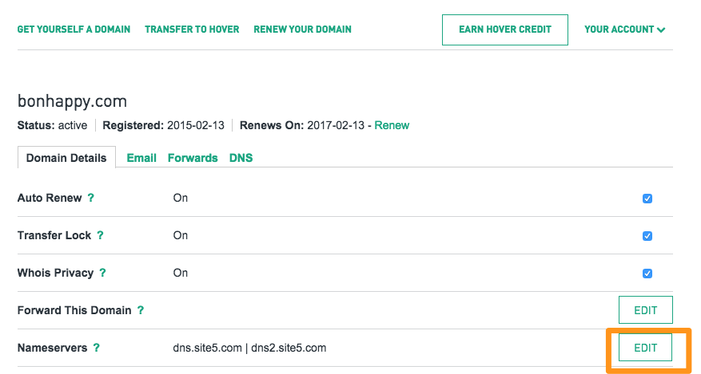


name: inverse
layout: true
class: center, middle, inverse

---

# Web Hosting

.title-logo[]

---
layout: false

# Agenda

1. Purchasing a domain name
2. Selecting a web host
3. Using FTP

---
template: inverse

# How Websites Get on the Web

---
class: center, middle

.large[
   Remember that you need two things to get your website on the web...
]

---
class: center, middle

.large[
   A domain name

   .red[**AND**]

   Space on a web server to host your website files
]

---
class: center, middle

---
template: inverse

# Purchasing a Domain Name

---

# Domain Registrars

There are plenty of domain name registrars out there...

We recommend [Hover](https://www.hover.com/) because it has a simple user interface and they don't try to up-sell you with extra services that you don't need when you buy your domain.

---

# Buying a Domain

To purchase a domain, follow these simple steps:

1. Go to [www.hover.com](https://www.hover.com/)
2. Type in your desired domain name
3. Add the domains you want to your cart
4. Register for the service and pay (keep this username and password handy)

---
template: inverse

# Selecting a Web Host

---

# Types of Web Hosting

So far, we've seen how we can use GitHub Pages to host our web pages, but there are many other options:

1. **Shared** hosting
2. **Managed** hosting
3. **Dedicated/VPS** hosting

---

# Shared Hosting

Shared hosting is the most **basic** and **inexpensive** hosting option.

The trade-off is that there can be **greater security risks** in these hosting environments, and you're also **sharing server resources** with other websites.

Some shared web hosting options include: [GreenGeeks](http://greengeeks.com/), [SiteGround](https://www.siteground.com/), [Bluehost](http://www.bluehost.com), and [Site5 Hosting](http://www.site5.com).

---

# Managed Hosting

Managed hosting is **more hands-on** than a typical shared hosting plan.

A managed hosting option will **provide software and security updates** for you, and a variety of other potential services such as spam filtering and caching.

Managed hosting is usually **more expensive** than shared hosting plans.

An example of a managed web host is [WP Engine](http://wpengine.com/).

---

# Dedicated/VPS Hosting

Dedicated web hosting means just that&mdash;your website **lives on a server by itself** and you control what's installed on it.

VPS hosting is like a **hybrid** of shared hosting and dedicated hosting. Your website will live on a server with other websites, but you control what's installed on the server.

Your VPS host will also provide a **minimum allocation of resources** for your site 24/7.

[Digital Ocean](https://www.digitalocean.com/) is an example of a VPS hosting option.

---

# Picking a Host

What hosting option you pick will depend on your needs and the type of website you're launching.

The key is to do your homework! Whichever option you choose, you want to make sure your host has:

- Consistent uptime
- 24/7 support
- Track record of good customer service

---

# Name Servers

Once you have a domain name and web hosting plan, you'll need to set your domain to point to your web host's public **name servers**.

Name servers will look something like this:

.center[
   `dns.site5.com` 
   `dns2.site5.com`  
]

Every web host will have unique name servers, and will likely email them to you when you sign-up for your account.

---
class: center, middle

.inline-images.border[
   
]

---
class: center, middle

.inline-images.border[
   
]

---
class: center, middle

.large[
   Then wait...
]

---
class: center, middle

### Domains with GitHub Pages

You can have a custom domain for your GitHub pages too by following [these instructions to configure your DNS](https://help.github.com/articles/setting-up-a-custom-domain-with-github-pages/).

---

# Exercise 1

In this exercise, you're going to purchase a domain name, and configure it's A record to point to your final project website.

---
template: inverse

# Using FTP

---
class: center, middle

### What is FTP?

FTP stands for **File Transfer Protocol**. It allows you to transfer files from your computer to a web server, and vice versa.

---

# How Does FTP Work?

In order to use FTP, you'll likely want to download and install an FTP client.

Some good options include:

- [FileZilla](https://filezilla-project.org/download.php?show_all=1) (Windows, Mac, Linux)
- [Cyberduck](https://cyberduck.io/?l=en) (Windows, Mac, Linux)
- [Transmit](https://panic.com/transmit/) (Mac)

---

# How to FTP

In order to place files on your server, you'll need to log into it:

.inline-images[
   
]

---

# How to FTP

Once you're in, you can start transferring files:

.inline-images[
   
]

<!--
---

# Exercise 2

In this exercise, you're going to practice FTPing a file.

Download an FTP client and use the credentials provided to FTP a file from your computer onto the server.
-->
---
template: inverse

# Questions?


